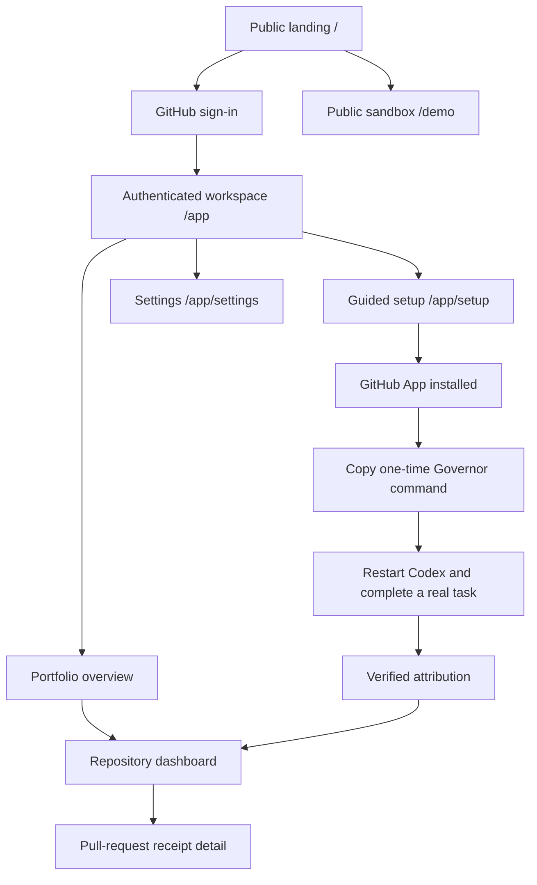
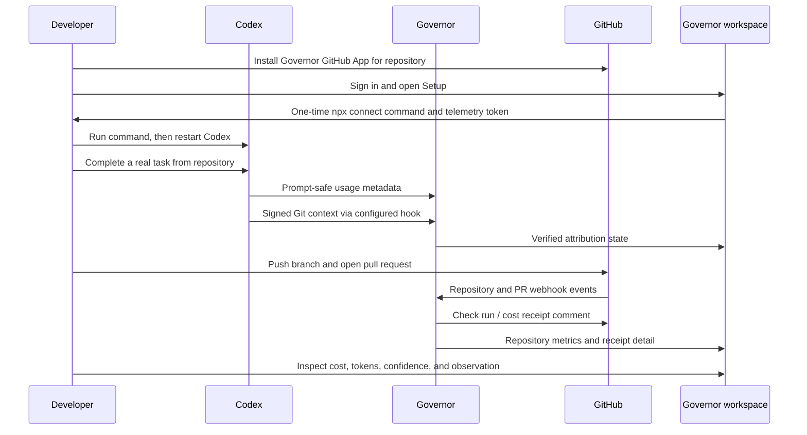

# Governor Frontend Design System and Experience Specification

**Version:** 1.0  
**Date:** July 20, 2026  
**Status:** Working MVP — implementation reference  
**Product:** Governor

---

## 1. Purpose of this document

This document describes the Governor frontend as it exists today: its product intent, information architecture, pages, components, states, visual system, data contracts, and known experience gaps.

It is intentionally an implementation-facing design document rather than a mock-up or a wishlist. It distinguishes between:

- **Implemented:** available in the current application.
- **Partially implemented:** a real experience exists, but has known constraints.
- **Not yet implemented:** important product work that is outside the current UI.

Governor is a control surface for AI-assisted software engineering spend. It turns prompt-safe Codex token metadata and signed Git context into transparent, estimated cost receipts for commits and pull requests. The frontend must make the result feel useful to an engineering lead without pretending that estimates are invoices or that an observation is an incident.

The intended user feeling is: **“I can see what AI-assisted work cost, trust how Governor reached that number, and quickly understand whether this PR deserves attention.”**

---

## 2. Product promise expressed in the UI

The frontend consistently communicates five promises.

| Promise | What the interface does |
| --- | --- |
| Cost belongs to work | Shows estimated Codex cost on a PR receipt, repository, and portfolio rather than presenting a disconnected usage total. |
| The estimate is auditable | Shows model line items, token counts, event count, confidence, deterministic explanation, and calculation version. |
| Privacy is a product boundary | Repeats that Governor stores token metadata and Git context, never prompts, responses, or generated code. |
| Insights are calm observations | Uses an indigo/teal observation panel, evidence, baseline, impact, and confidence—not alarm language or policy enforcement. |
| Setup should be understandable | Frames onboarding as a simple connection between Codex, Governor, and GitHub, then confirms a real attributed turn. |

### Terminology rules

| Use | Avoid | Why |
| --- | --- | --- |
| “Estimated Codex cost” | “Spend” by itself in user-facing receipt copy | Cost is a token-rate estimate, not an invoice. |
| “Token-rate estimate” | “Billed amount” | Governor does not receive billing invoice data. |
| “Governor observation” | “Alert”, “violation”, “incident” | Findings are evidence-based insights, not policy failures. |
| “Attribution confidence” | “Accuracy guarantee” | Confidence represents how directly usage was joined to signed Git context. |
| “Prompt-safe telemetry” | “We collect your Codex data” | The product must make the precise privacy boundary clear. |

---

## 3. Audience and primary jobs

### Primary audience

- Individual developers using Codex in Git repositories.
- Engineering leads who want a reliable, low-friction view of AI development cost.
- Hackathon judges evaluating an understandable, end-to-end developer tool.

### Core jobs to be done

| User | Job | Governor’s answer |
| --- | --- | --- |
| Developer | “Show me that my Codex work was actually attributed to my branch or PR.” | Signed Git context, real-turn verification, event count, and receipt confidence. |
| Engineering lead | “Which recent PRs cost the most, and why?” | Portfolio receipt list, repository dashboard, PR receipt detail, model mix, and observations. |
| Security-conscious evaluator | “What does this product see?” | Persistent privacy language: token metadata plus Git context; no prompts, responses, or generated code. |
| New user | “Can I get this working without learning the architecture?” | GitHub App installation, one copyable setup command, restart Codex, complete a real task, verify. |

---

## 4. Current frontend surface map

Governor has three product surfaces: a public landing page, a safe public demo, and an authenticated workspace.

| Route | Access | Purpose | Current status |
| --- | --- | --- | --- |
| `/` | Public | Explain the product and route visitors to sign-in or the demo. | Implemented |
| `/demo` | Public | Show anonymized, seeded sample data without exposing a real account. | Implemented |
| `/app` | Authenticated | Portfolio overview across GitHub-authorized Governor repositories. | Implemented |
| `/app/setup` | Authenticated | Install/verify workflow and one-time telemetry command. | Implemented |
| `/app/settings` | Authenticated | Account, session, token-management entry point, and privacy boundary. | Implemented |
| `/app/repos/[owner]/[repo]` | Authenticated and authorized | Repository analytics, receipts, usage activity, and telemetry health. | Implemented |
| `/app/repos/[owner]/[repo]/pulls/[number]` | Authenticated and authorized | Detailed PR cost receipt and Governor observation. | Implemented |
| `/api/auth/github/start` | Public entry action | Starts GitHub OAuth sign-in. | Implemented |
| `/api/auth/logout` | Authenticated action | Invalidates the Governor session. | Implemented |

The workspace route group is server-protected. An unauthenticated visitor is redirected to GitHub sign-in. A signed-in user only sees repositories that both have Governor data and are accessible through their GitHub authorization.

---

## 5. Information architecture



### Desktop workspace navigation

The authenticated app uses a persistent left sidebar.

1. **Wordmark:** `governor.`
2. **Workspace links:** Overview, Setup, Settings.
3. **Repositories rail:** accessible repositories supplied from the user’s authenticated GitHub context.
4. **Footer:** prompt-safe telemetry indicator and signed-in GitHub login.

The active workspace page or current repository is visually highlighted. Repository items become active when the current pathname begins with that repository’s route.

### Mobile navigation

At narrow widths, the desktop sidebar is removed and a compact top bar appears. It currently exposes:

- Governor wordmark
- Overview link
- Setup link

The compact mobile bar does **not** currently expose Settings, a repository switcher, an account menu, or a navigation drawer. This is a known limitation, documented later in this specification.

---

## 6. End-to-end user journeys

### 6.1 Visitor evaluating Governor

1. Visitor arrives on `/`.
2. They read the product proposition and privacy boundary.
3. They choose either:
   - **Open your workspace** → GitHub OAuth, or
   - **View the public sandbox** → `/demo`.
4. The sandbox uses anonymized seeded data, so no account, token, or repository is exposed.

### 6.2 First-time user connecting one repository

1. User signs in with GitHub.
2. User installs the public Governor GitHub App for one or more repositories.
3. GitHub returns to Governor’s setup page.
4. `/app` lists accessible installed repositories; Setup shows that the GitHub App connection is ready.
5. User opens **Setup**.
6. Governor displays a one-time setup command containing a telemetry token.
7. User copies the command and runs it locally.
8. The Governor CLI backs up the local Codex configuration, preserves existing Codex notification behavior where supported, configures prompt-safe telemetry, and keeps prompts disabled.
9. User fully restarts Codex so the configuration loads.
10. User performs one real Codex task from the connected repository.
11. Governor joins the signed Git context and matching usage metadata.
12. Setup polling detects a verified real turn and shows the success state.
13. The user can now push a branch and open a PR to receive a GitHub comment/check and a dashboard receipt.

### 6.3 Returning user reviewing portfolio health

1. User signs in and lands at `/app`.
2. The overview shows 7-day and 30-day estimated cost, active repositories, receipts posted, and integration health.
3. User opens a repository from the left rail or connected repository list.
4. User scans spend trend, model mix, recent receipts, and recent usage activity.
5. User opens a high-cost receipt for evidence and any Governor observation.

### 6.4 Reviewing one pull-request cost receipt

1. User opens a receipt from the portfolio or repository table.
2. The page foregrounds the estimated cost, event count, and attribution confidence.
3. A Governor observation appears only if sufficient deterministic evidence exists.
4. User reviews model-level token counts and cost.
5. User reads the deterministic explanation, confidence, and privacy boundary.
6. User may open the original GitHub PR in a new tab.

### 6.5 Replacing a telemetry token

1. User returns to Setup after the raw token has already been issued or needs replacement.
2. The UI explains that a command has already been issued and exposes a verification command.
3. User chooses **Create a replacement command** only if needed.
4. Governor issues a new one-time token and invalidates the previous token.
5. The command includes `--replace`, allowing the CLI to replace only Governor’s managed local OTel configuration after a backup.
6. User runs it, restarts Codex, and verifies another real task.

---

## 7. Visual direction

### Design character

Governor uses a dark, calm, developer-control aesthetic. It should feel closer to a precise engineering console than a consumer finance dashboard:

- GitHub-adjacent in clarity and density.
- Evidence-first rather than decorative.
- Calm about money: no aggressive charts, red “overspend” alarms, or simulated invoice language.
- High contrast enough for long technical reading sessions.
- Restrained use of accent color so validation, privacy, and observations retain meaning.

### Color system

| Token | Value | Role |
| --- | --- | --- |
| `--bg` | `#0b1016` | Application background. |
| `--surface` | `#121a22` | Primary card and panel surface. |
| `--surface-2` | `#18232e` | Raised/secondary surface. |
| `--line` | `#273544` | Standard border and separator. |
| `--line-soft` | `#1d2a36` | Softer divider. |
| `--text` | `#edf4f8` | Primary text. |
| `--muted` | `#91a1ae` | Supporting copy. |
| `--dim` | `#657581` | Quiet labels and tertiary metadata. |
| `--accent` | `#7ea6ff` | Primary action and interactive emphasis. |
| `--teal` | `#68d4c0` | Positive connection, verification, privacy signal, chart accent. |
| `--teal-soft` | `#123c3d` | Teal contextual background. |
| `--indigo` | `#8f8cff` | Governor observation accent. |
| `--indigo-soft` | `#202750` | Observation panel background. |
| `--good` | `#77d6a5` | Positive/verified status. |

### Color semantics

- **Blue accent:** calls to action, links, selected controls.
- **Teal:** successful integration, signal/connection, privacy-safe telemetry, chart fill.
- **Indigo:** Governor observation and analytical insight.
- **Green:** verified/completed state.
- **Red:** intentionally not a dominant part of the current product language. Error text can be added later, but observations must never use alarm styling by default.

### Typography

- Font stack: Inter when available, then system UI sans-serif fallback.
- Large headings use tight letter spacing and strong weight.
- General page headings scale from roughly `30px` to `46px` based on viewport.
- Landing hero type scales from approximately `50px` to `84px`.
- Labels are uppercased, small, letter-spaced, and muted/blue to establish hierarchy.
- Monetary values use strong, large numeric treatment; supporting currency context remains visible.

### Spatial system

- Main app desktop content maximum width: approximately `1360px`.
- Desktop app content padding: approximately `47px` top, responsive horizontal padding, `70px` bottom.
- Desktop sidebar width: `252px`.
- Narrow desktop sidebar width: `208px` below the tablet breakpoint.
- Typical card rhythm: thin border, roughly `16px` corner radius, generous internal padding, subtle dark shadow.
- Two-column analytics sections collapse to one column below `980px`.
- Compact mobile layout activates below `700px`.

### Background and elevation

The background has a restrained radial glow near the top rather than a flat black canvas. Cards use surface color, fine blue-gray borders, and a soft large shadow. This creates hierarchy while avoiding the heavy “glassmorphism” look that can make data feel less trustworthy.

### Iconography

The application currently uses small text symbols, simple glyphs, and geometric markers rather than a full icon library. Examples include a signal dot, repository hash, arrows, refresh glyph, setup-step numerals, and the observation star/spark. There are no raster illustrations or external visual assets in the present UI.

---

## 8. Reusable interface primitives

### App shell

**Responsibility:** authentication-aware layout, desktop navigation, compact mobile navigation, and main content container.

**Desktop anatomy:**

```text
+------------------------+------------------------------------------------+
| governor.              |                                                |
|                        |                Page content                    |
| WORKSPACE              |                                                |
| [ Overview ]           |                                                |
|   Setup                |                                                |
|   Settings             |                                                |
|                        |                                                |
| REPOSITORIES           |                                                |
| # owner/repository     |                                                |
|                        |                                                |
| • Prompt-safe telemetry|                                                |
| @github-login          |                                                |
+------------------------+------------------------------------------------+
```

### Page header

Shared composition:

- optional eyebrow label;
- primary title;
- short description or supporting metadata;
- optional action area, such as manual refresh or external GitHub link.

The header creates a predictable start for workspace pages while allowing each product surface to carry its own job-specific context.

### Cards and panels

All dashboard content is built from a consistent panel treatment:

- dark surface;
- subtle outlined border;
- rounded corners;
- balanced padding;
- quiet shadow;
- interior dividers for dense row lists.

Primary types include metric cards, list panels, calculation panels, setup panels, empty states, privacy notices, and the Governor observation panel.

### Metrics

Metric cards show a small label, a large value, and optional supporting text. Current portfolio and repository screens use four metric cards, collapsing to two columns on smaller screens.

Examples:

- 7-day estimated cost
- 30-day estimated cost
- active repositories
- PR receipts
- attribution confidence

### Tables and receipt rows

Receipt lists behave like lightweight tables without full spreadsheet controls. Rows generally include:

- repository and PR context;
- PR title;
- estimated cost;
- event count;
- attribution quality;
- click target to open receipt detail.

Rows are interactive through their containing links rather than a separate “view” button. This supports quick scanning and a low-ceremony workflow.

### Status badges and signals

The design prefers plain language with small visual reinforcement over a large inventory of badge colors. Common states include:

- Connected / verified: teal or green visual signal.
- Exact context: concise attribution label.
- Inferred context: reduced-confidence label.
- Gathering baseline: quiet neutral analytical state.
- Public sample: explicit demo label.

### Buttons and text links

| Control | Purpose |
| --- | --- |
| Primary button | Main commitment: connect GitHub, open workspace, copy command, open setup. |
| Secondary/quiet button | Refresh, replacement-token action, or less primary route. |
| Text link | Low-friction navigation, GitHub PR link, return to landing. |
| Copy command button | Copies exact command to clipboard; command remains visible for manual selection as fallback. |

### Privacy notice

The privacy notice is a reusable component placed where a user may reasonably wonder what the data represents. Its key message is stable:

> Governor stores token metadata and signed Git context, never prompts, responses, or generated code.

This repetition is intentional. Privacy is central to adoption and credibility, not a single legal footnote.

### Empty state

Empty states include an icon/glyph, direct title, concise recovery instruction, and when appropriate a setup action. They avoid implying that zero data is an error.

---

## 9. Public landing page (`/`)

### Purpose

Convert a curious developer or evaluator into either:

- a signed-in Governor user, or
- an informed viewer of the safe public demo.

### Layout and content

#### Navigation

- Left: `governor.` wordmark.
- Right: **Explore demo** text link and **Connect GitHub** action.
- The primary workspace action directs to `/api/auth/github/start`.

#### Hero

| Element | Current content/behavior |
| --- | --- |
| Eyebrow | “AI engineering spend, in context” |
| Headline | “Every Codex dollar, attached to the work it produced.” |
| Supporting copy | Frames Governor as transparent estimated cost receipts for commits and PRs. |
| Primary CTA | “Open your workspace →” starts GitHub OAuth. |
| Secondary CTA | “View the public sandbox” opens `/demo`. |
| Proof line | Signal dot + “Token metadata + Git context only • Never prompts, responses, or generated code” |

#### Three-step value explanation

| Number | Heading | Meaning |
| --- | --- | --- |
| 01 | Observe work | Governor joins Codex token metadata with repository, branch, commit, and session context. |
| 02 | Calculate clearly | Effective-dated rates and confidence produce a transparent estimate. |
| 03 | Govern with context | Receipts appear on PRs and reveal emerging patterns. |

### State behavior

The landing page is static and public. It does not change based on authenticated state, repository count, or telemetry health.

### Intentional omissions in the current landing page

- No pricing.
- No FAQ.
- No long installation guide.
- No customer logos, testimonials, or case studies.
- No feature grid beyond the three core concepts.
- No footer navigation.

These omissions keep the current MVP landing page focused, but a later production launch will likely need at least a footer, installation/support destinations, and clearer app-distribution information.

---

## 10. Public sandbox (`/demo`)

### Purpose

Let a visitor understand the product without asking them to sign in, install a GitHub App, or reveal a real repository. The sandbox is deliberately labelled as anonymized sample data.

### Entry context

A slim banner communicates:

- “Public sandbox - anonymized sample data only”
- a return route back to the main site.

### Content structure

#### Public product-tour hero

| Element | Current behavior |
| --- | --- |
| Eyebrow | “Public product tour” |
| Title | “See the cost behind a pull request.” |
| Supporting copy | Explains that the page is a safe preview of a real Governor receipt. |
| CTA | “Connect your GitHub →” starts OAuth. |

#### Sample metrics

The page presents four seeded summary metrics:

- 7-day estimated cost
- 30-day estimated cost
- PR receipts
- attribution confidence

The data comes from a fixed anonymized sample repository (`acme/checkout`) rather than a visitor’s account.

#### Sample receipt and observation story

The central content is a two-column story.

| Column | Content |
| --- | --- |
| Sample receipt | First seeded receipt, PR number/title, sample label, estimated cost, event count, exact-context label, model line items, invoice disclaimer. |
| Governor observation — sample | Clearly marked illustrative insight about low cache reuse, including evidence, dollar impact, confidence, and deterministic calculation framing. |

The sample observation is not presented as a live analysis of the visitor. Its explicit sample label is essential to preserve trust.

#### “How it works” sequence

1. Codex emits prompt-safe token metadata.
2. Governor joins it to signed Git context.
3. GitHub receives an auditable PR receipt.

#### Privacy notice

The sandbox ends with the same privacy boundary used across the app.

### Current constraints

- The sandbox is a guided static experience, not a fully navigable fake workspace.
- There are no public demo receipt-detail routes.
- There is no interactive date range, filtering, live refresh, or model drill-down.
- The observation is illustrative seeded content rather than a dynamic simulation.

---

## 11. Authenticated app shell (`/app/*`)

### Authentication behavior

Each workspace route resolves an authenticated Governor session on the server. When no valid session exists, the visitor is redirected to the GitHub OAuth start route.

### Authorization behavior

The application does not treat sign-in alone as authorization to every Governor repository. Repository links and data are filtered through the current user’s GitHub-authorized access, preventing the workspace from exposing other installations or organizations’ receipt data.

### Desktop sidebar behavior

| Area | Detail |
| --- | --- |
| Brand | Governor wordmark at top. |
| Workspace group | Overview, Setup, Settings. |
| Active route | Current link has an emphasized filled/outlined active state. |
| Repository rail | Lists accessible Governor repositories. Current repository is active based on pathname. |
| Footer | Prompt-safe telemetry dot plus authenticated GitHub login. |

### Mobile header behavior

At `700px` and below:

- desktop sidebar is hidden;
- a compact fixed-height mobile header takes its place;
- overview and setup remain directly available;
- page content padding is reduced and card grids compress.

### Current navigation limitations

- No collapsible mobile navigation drawer.
- No mobile repository picker.
- No visible mobile Settings link.
- No account/avatar menu.
- No global search.
- No notifications or activity inbox.
- No breadcrumb trail; context comes from the page header and selected repository rail item.

---

## 12. Portfolio overview (`/app`)

### Purpose

Give a signed-in user a portfolio-level answer to: “What is happening across my connected AI-assisted repositories?”

### Data dependencies

The server gathers:

- accessible Governor repositories;
- per-repository overview data;
- portfolio 7-day and 30-day totals;
- recent receipts;
- telemetry/verification health.

### Zero-repository state

When no accessible repositories are available, the page shows:

- standard workspace header;
- empty-state icon;
- title: “No repositories yet”; and
- a direct action to Setup.

The recovery path is intentionally installation-first rather than asking the user to manually enter a repository slug.

### Populated layout

#### Header

| Element | Current content |
| --- | --- |
| Eyebrow | “Engineering spend control” |
| Title | “Your AI engineering workspace” |
| Description | Summary of portfolio-level visibility. |
| Right-side control | Manual refresh alongside automatic refresh behavior. |

#### Portfolio metric row

| Metric | Meaning |
| --- | --- |
| 7-day spend | Estimated Codex cost in the most recent seven-day window. |
| 30-day spend | Estimated Codex cost in the most recent thirty-day window. |
| Active repositories | Number of accessible repositories with Governor context. |
| Receipts posted | Count of receipt records available to the workspace. |

#### Connected repositories panel

Each repository row includes:

- repository slug;
- telemetry health / connection status;
- 30-day estimated cost;
- directional affordance to open that repository.

#### Integration health panel

This panel tells the user either:

- recent telemetry is flowing, or
- they need to finish the first verified Codex turn.

It contains a setup action when onboarding is incomplete.

#### Recent PR receipts panel

Shows up to eight most recent receipts. Rows contain repository and PR context, PR title, cost, event count, and exact/inferred attribution label. Each row opens the relevant receipt detail page.

When no receipt exists, the page gives a plain-language next action: use Codex on a branch, then push and open a PR.

### Live update behavior

- Automatic refresh: every 30 seconds via router refresh.
- Manual refresh: a user-triggered control.
- No WebSocket or server-sent event connection in the current release.
- The interface currently does not show a “last updated” time, refresh spinner, or in-progress request state.

---

## 13. Repository dashboard (`/app/repos/[owner]/[repo]`)

### Purpose

Help the user answer four repository-specific questions:

1. How much has Codex-assisted work cost recently?
2. Which models account for that cost?
3. Which PRs have receipts?
4. Is telemetry currently producing attributable activity?

### Access behavior

The route checks access server-side. A user cannot open a repository URL merely by guessing its owner and name unless the current GitHub session authorizes access to that repository.

### Header

| Element | Detail |
| --- | --- |
| Eyebrow | “Repository overview” |
| Title | Full `owner/repository` slug. |
| Supporting metadata | Default branch and last known activity. |
| Action | Automatic/manual refresh control. |

### Metric row

| Metric | Detail |
| --- | --- |
| 7-day | Recent estimated Codex cost. |
| 30-day | Thirty-day estimated Codex cost. |
| PR receipts | Receipts recorded for this repository. |
| Attribution confidence | Aggregate confidence for available receipt activity. |

### Spend trend panel

**Label:** “Last 14 days”  
**Presentation:** CSS bar chart with day-level estimate bars.

Each bar represents a date and money total. The chart is intentionally compact and descriptive rather than a high-interaction finance visualization. It is paired with “token rate” language to reinforce the estimate boundary.

**Empty state:** “Spend will appear after the first attributed turn.”

### Model mix panel

Displays model-level contribution using:

- model name;
- compact token count;
- estimated model cost;
- relative teal bar.

The model mix helps explain whether high spend came from a larger/expensive model, a high volume of events, or a particular usage distribution.

### Receipt table

Shows repository PR receipts in a click-through list. It functions as the main bridge to detailed proof rather than trying to contain all calculation information in the dashboard.

### Recent activity panel

Shows up to seven recent usage events with:

- model;
- branch;
- formatted timestamp;
- per-event estimated cost.

This is activity context, not an audit-log product. It is intentionally short and designed to answer whether work is arriving now.

### Current constraints

- No date-range selector; metrics remain 7/30 days and chart remains 14 days.
- No filtering by branch, model, developer, PR state, or attribution confidence.
- No CSV/JSON export from the UI.
- No receipt search.
- No chart tooltip, keyboard data table alternative, or detailed daily drill-down.
- No explicit “last activity stale” threshold in the UI.

---

## 14. Pull-request receipt detail (`/app/repos/[owner]/[repo]/pulls/[number]`)

### Purpose

Make a single estimate inspectable and explainable. This is the most important proof surface in Governor because it ties the monetary result directly to real engineering work.

### Header and receipt identity

| Element | Detail |
| --- | --- |
| Eyebrow | “Pull request receipt · owner/repository” |
| Title | `#PR-number` plus PR title. |
| Supporting metadata | Receipt update time and shortened commit SHA. |
| External action | Opens the associated GitHub PR in a new tab. |

### Cost hero

The primary panel shows:

- total **estimated Codex cost**;
- usage event count;
- attribution confidence;
- a supporting confidence card describing signed Git context attribution.

The cost hero intentionally does not say “invoice total,” “billed,” or “actual charge.”

### Governor observation block

The observation block is the visible analytical moment of the product. It appears before the token tables so a user can first understand whether the receipt has a meaningful pattern worth reading.

#### Visual treatment

- Calm indigo/teal panel, distinct from generic cards.
- Spark/insight glyph.
- Label: “Governor observation”.
- Never styled as a red incident or policy violation.

#### Eligible observation content

When a deterministic observation exists, the block presents:

| Field | Meaning |
| --- | --- |
| Title | Short plain-language finding. |
| Explanation | One concise explanation grounded in supplied evidence. |
| Evidence/baseline | The observed measure and relevant repository baseline or threshold. |
| Impact estimate | Estimated dollars affected when deterministically available. |
| Confidence | Confidence in the observation itself. |
| Calculation version | Version identifier supporting auditability. |

Example intended content:

> **Low cache reuse increased estimated cost**  
> Cache utilization was 12% versus this repository’s 64% baseline; approximately $3.10 of this receipt was reprocessed context.

#### Baseline-gathering state

When the receipt does not have sufficient historical data for a trustworthy observation, the panel still appears in a quiet state:

> **Governor is gathering a baseline**

It does not invent a finding merely to make the AI feature look active.

#### Analytical constraints behind the UI

Observations are calculated from deterministic structured facts. Candidate categories include:

- unusually low cache utilization;
- PR cost materially above repository baseline;
- unusually expensive model mix;
- low attribution confidence.

If generated language is used, it receives only the structured evidence and may explain it concisely. It must not change the category, calculated impact, baseline, or confidence. The receipt stores structured observation output so the dashboard, detail page, API, and GitHub can agree on the same finding.

### Model and token breakdown

Each model line includes:

- model name;
- input token count;
- cached-input token count;
- output token count;
- estimated cost attributable to that model.

This is where technical users can reconcile the cost total with usage inputs.

### Deterministic calculation panel

The calculation panel shows:

- stored explanatory text, or a deterministic fallback;
- attribution treatment;
- effective-dated token-rate method;
- explicit promise that prompts and generated code are not stored.

### Footer privacy notice

The receipt ends with the reusable privacy boundary, reinforcing that detailed provenance does not mean Governor sees sensitive prompt or source content.

### Current constraints

- No downloadable PDF/CSV receipt.
- No “copy calculation” action.
- No visible calculation timeline or raw event list on the detail page.
- Effective rate date is described conceptually but is not rendered as a detailed per-model historical rate table.
- No receipt comments, owner assignment, acknowledgment, or policy action.
- No direct GitHub comment/check rendering in the web receipt; it links outward to GitHub instead.

---

## 15. Guided setup (`/app/setup`)

### Purpose

Turn a complicated integration concept into one understandable flow: install GitHub App → run a local command → verify one real Codex turn.

### Header

| Element | Current content |
| --- | --- |
| Eyebrow | “Guided setup” |
| Title | “Connect Codex to Governor” |
| Supporting copy | Governor joins prompt-safe token metadata to signed Git context and publishes receipts to GitHub. |

### Three-step setup map

#### Step 1 — Install the GitHub App

The UI identifies whether Governor can see accessible repositories.

- **Connected state:** teal checked treatment and accessible repository count.
- **Not connected state:** directs the user to install/configure the GitHub App.

The GitHub App is responsible for receiving repository events and publishing PR-facing output; it is separate from the local Codex telemetry setup.

#### Step 2 — Run one local command

The interface explains that the command configures Governor alongside local Codex usage. It emphasizes:

- Governor creates a config backup.
- Existing Codex notifications are preserved where compatible.
- Prompt collection remains disabled.
- The token should be treated like a password.

#### Step 3 — Verify a real Codex turn

The interface asks the user to:

1. fully restart Codex;
2. complete one real request in the installed repository; and
3. wait for Governor to join signed Git context and matching usage metadata.

### One-time command panel

The setup command uses the published Governor CLI package:

```powershell
npx --yes @muzman123/governor@latest connect --url https://governor-fawn.vercel.app --token gov_...
```

The actual rendered command uses the configured Governor URL and one-time token. The UI includes a Copy command control.

#### Command states

| State | User sees | Meaning |
| --- | --- | --- |
| Loading | Setup command is being requested. | Browser is retrieving a one-time token. |
| Ready | Copyable `connect` command with raw token. | User must copy/run it before leaving or reloading. |
| Already issued | Verification command and replacement option. | Raw token is not revealed again by design. |
| Replacement issued | Copyable command includes `--replace`. | Prior telemetry token is revoked; CLI safely replaces Governor-managed OTel config after backup. |
| Verified | Positive connection panel. | A real Codex attribution join has been observed. |
| Error | Plain error copy. | User should retry or use troubleshooting. |

### Why a token displays only once

The raw telemetry token is a credential for the local device to submit/verify telemetry. Governor deliberately does not show its original raw value after issuance. This reduces server-side secret exposure. If a user reloads before copying it, the supported recovery path is generating a replacement command, which invalidates the old token.

### Verification status behavior

The page polls setup status every five seconds. It checks for a recent verified session where Governor has joined a real signed context with usage events. On success, the panel changes to a positive state and explains that future pushes and PRs can create receipts.

### Troubleshooting panel

The current setup page explains what “connected” means across three separate integration layers:

| Layer | Connected means |
| --- | --- |
| GitHub App | Governor can receive repository push and pull-request events. |
| Codex telemetry | Codex has sent token metadata with prompts disabled. |
| Verification | Governor joined a real usage event to signed Git context. |

### Current setup constraints

- It assumes Codex and Node/npm are already available locally.
- The command refers to the current public npm package scope: `@muzman123/governor`.
- No browser-based terminal output stream or in-product command execution exists.
- Verification is polling-based rather than a persistent live connection.
- Raw tokens can still be exposed if a user screen-shares, copies them into tickets, or leaves them in terminal history; the page warns users to treat the token like a password.
- The page has no explicit “copy succeeded” toast/confirmation state.
- No guided OS-specific tabs yet (Windows/macOS/Linux).
- No automated diagnosis page for failed local OTel configuration.

---

## 16. Settings (`/app/settings`)

### Purpose

Provide a minimal account and trust-control location without turning MVP settings into an administration product.

### Current cards

#### GitHub identity

Displays:

- signed-in GitHub login;
- available email when provided;
- session expiry date;
- **Sign out** action.

Sign out calls the authenticated logout route and returns the user to the public product surface.

#### Data boundary

Explains the Governor privacy contract:

- token metadata is used;
- signed Git context is used;
- prompts, responses, and generated code are not stored.

#### Telemetry token

Directs the user back to Setup to rotate/reissue a telemetry setup command. This is intentional: setup retains the contextual warning that a rotation invalidates the prior token and may need `--replace` locally.

### Current settings constraints

- No repository installation manager.
- No per-repository enable/disable controls.
- No token history, device list, last-used time, or revoke-without-replace action.
- No session list.
- No account deletion/export UI.
- No organization/team membership management.
- No avatar or account-menu surface.

---

## 17. State, loading, error, and recovery design

### Current state inventory

| Surface | State | Current UX | Recovery path |
| --- | --- | --- | --- |
| Workspace | Unauthenticated | Server redirect to GitHub OAuth. | Sign in. |
| Workspace | No accessible repositories | Empty state with Setup action. | Install GitHub App / choose repository. |
| Overview | No receipts | Plain next-step copy. | Use Codex in a branch, push, open PR. |
| Repository | No attributed usage | Spend-trend empty message. | Complete/verify a real Codex task. |
| Setup | No GitHub App repository visible | Setup indicates installation incomplete. | Install/configure GitHub App. |
| Setup | Command loading | Textual loading state. | Wait/retry. |
| Setup | Token already issued | Verification command plus replacement action. | Verify, or intentionally replace. |
| Setup | No verified event yet | Instructions and five-second polling. | Restart Codex, do real task from repo. |
| Receipt | Baseline insufficient | “Governor is gathering a baseline.” | Accumulate more eligible history. |
| Receipt | Observation eligible | Calm evidence panel. | Inspect calculation and GitHub PR. |

### Error behavior

Server route failures currently surface through Next.js error rendering rather than a polished, product-specific error system. The application has no shared visual error boundary that explains whether a failure is caused by GitHub authorization, expired session, stale data, or an internal query issue.

This is important to state precisely: earlier production issues caused by timestamp shape differences were resolved defensively in dashboard data normalization, but the frontend still needs friendlier recovery screens for unexpected errors.

### Loading behavior

- Initial server-rendered pages largely wait for data before rendering.
- Setup uses text-level loading for one-time token retrieval.
- Auto-refresh does not display a persistent loading indicator.
- No skeleton components or Suspense-specific visual shells are currently implemented.

---

## 18. Responsive behavior

### Desktop: above 980px

- Full 252px sidebar.
- Main workspace content beside sidebar.
- Metric rows commonly render four columns.
- Dashboard analytics, setup panels, and receipt sections use two-column layouts where appropriate.
- Landing hero uses broad desktop typography and multi-column feature explanation.

### Tablet/narrow desktop: 701px–980px

- Sidebar narrows to about 208px.
- Two-column sections collapse where space becomes constrained.
- Metric grid moves toward two columns.
- Content remains within the authenticated shell rather than switching to a separate tablet route.

### Mobile: 700px and below

- Sidebar hides.
- Compact header appears.
- Main content padding reduces.
- Metric cards render in two columns.
- Landing and demo story sections stack vertically.
- Receipt cost hero and other multi-column content stack.
- Command boxes remain selectable and scroll/wrap within the constraints of the narrow screen.

### Mobile gaps

- No menu drawer means repository switching is difficult or impossible from the primary mobile navigation.
- Settings is not directly reachable through the mobile header.
- Dense model/token data may require careful scrolling but has not yet received a dedicated mobile table pattern.
- No viewport-specific chart alternative has been designed beyond normal CSS reflow.

---

## 19. Live-data and interaction behavior

### Refresh model

| Surface | Refresh mechanism | Interval |
| --- | --- | --- |
| Portfolio overview | `router.refresh()` plus manual control | 30 seconds |
| Repository dashboard | `router.refresh()` plus manual control | 30 seconds |
| Setup verification | Status API polling | 5 seconds |
| Receipt detail | Server-rendered on navigation/reload | No automatic polling specified |
| Public demo | Seeded data | Static |

Governor intentionally avoids WebSockets in this release. Dashboard data is operationally useful with simple periodic refresh, and the product does not yet need cursor-level real-time event streaming.

### Frontend-facing API map

| Endpoint | Consumer | UI purpose |
| --- | --- | --- |
| `GET /api/app/me` | Authenticated app | Current account/session identity. |
| `GET /api/app/repositories` | App shell and workspace data | Accessible repositories. |
| `GET /api/app/setup/token` | Setup panel | Requests a one-time telemetry token/command. |
| `POST /api/app/setup/token` | Setup panel | Rotates/reissues telemetry command. |
| `GET /api/app/setup/status` | Setup panel | Polls real-turn verification state. |
| Repository overview APIs/data layer | Overview/repository routes | Metrics, receipt rows, model mix, events, health. |
| Receipt detail APIs/data layer | Receipt route | Cost line items, attribution, explanation, observation. |
| `POST /api/auth/logout` | Settings logout action | Invalidates authenticated Governor session. |

### Security boundary reflected in the UI

- Browser receives only what it needs to render the current authorized workspace.
- Governor sessions are opaque HTTP-only cookies; GitHub authorization material stays server-side.
- Repository pages are server-authorized, not protected only by hidden navigation links.
- Setup token is sensitive and displayed only at issuance time.
- Amounts remain labelled as estimates because pricing is rate-based and receipt-oriented.

---

## 20. Observation design contract

The observation feature should remain a strict analytical contract, even as its language becomes more polished.

### Candidate categories

| Category | Required evidence | Example user-facing result |
| --- | --- | --- |
| Low cache utilization | Receipt cache ratio, established repo baseline, threshold, estimated impact. | “Low cache reuse increased estimated cost.” |
| Cost above repository baseline | Receipt cost, historical receipt distribution, minimum sample size. | “This PR cost materially more than typical work in this repository.” |
| Expensive model mix | Receipt model shares and repository model-mix baseline. | “Higher-cost model usage contributed more than usual.” |
| Low attribution confidence | Attribution context facts and confidence rules. | “This estimate has lower context confidence than Governor’s exact matches.” |

### Eligibility rules

1. Gather enough comparable historical receipts before calculating a baseline.
2. Compute observation category, evidence, threshold, impact, and confidence deterministically.
3. Suppress the observation when the evidence is not sufficient.
4. Render the baseline-gathering state instead of manufacturing insight.
5. Persist structured output with the receipt so every product surface agrees.

### Presentation rules

- One concise headline.
- One evidence-grounded explanatory sentence.
- Always show evidence/baseline when an insight is present.
- Show dollars only when the impact estimate is deterministically available.
- Keep confidence visible.
- Provide a “how calculated” route/field when expanded product interaction is added.
- Avoid speculative causes, blame, developer performance judgments, or commands framed as policy.

### Why this is the AI moment

Raw cost is useful but not differentiated. The observation turns a receipt from “this happened” into “this pattern may be worth understanding,” while keeping the calculation auditable and the model’s narrative bounded by deterministic evidence.

---

## 21. Content and trust guidelines

### Voice

- Direct and concrete.
- Technically literate without assuming the user already understands OTel or GitHub App architecture.
- Calm around sensitive operational information.
- Honest about estimate quality and limitations.

### Good examples

- “Estimated Codex cost: $0.40”
- “27 usage events · attribution: 100% exact context”
- “Governor is gathering a baseline.”
- “This deterministic engineering cost estimate uses effective-dated token rates.”

### Avoid

- “You overspent.”
- “This is your actual AI bill.”
- “Governor analyzed your prompt.”
- “Security incident.”
- “AI says this PR is bad.”

### Privacy copy placement

Privacy language appears in:

- landing hero proof line;
- public demo;
- setup explanation;
- receipt calculation panel and footer;
- settings data-boundary card;
- shell telemetry indicator.

This multi-surface placement protects comprehension for both a first-time evaluator and a recurring user.

---

## 22. Accessibility and inclusive-design status

### Present strengths

- Most primary actions use native links or buttons.
- Strong foreground/background contrast in the dark palette.
- Text labels accompany most visual status signals.
- Public/demo/private boundaries are explicit in written copy.
- Layout reflows at defined breakpoints instead of forcing desktop-only horizontal scrolling.

### Work still required

- Define and test visible keyboard focus states across all interactive controls.
- Add a skip-to-content link for persistent navigation.
- Add explicit `aria-label` text where glyph-only controls are retained.
- Ensure refresh and copy interactions communicate completion/errors through accessible live regions.
- Provide an accessible tabular/text alternative for chart data.
- Verify contrast ratios for muted labels and small text against surfaces.
- Design mobile navigation with complete keyboard and screen-reader access.
- Ensure long repository slugs, PR titles, and commands wrap without overlap at all zoom levels.

---

## 23. Current implementation inventory

### Routes

| File | Responsibility |
| --- | --- |
| `app/layout.tsx` | Global metadata, root layout, and global styles. |
| `app/page.tsx` | Public landing page. |
| `app/demo/page.tsx` | Public seeded sandbox. |
| `app/app/layout.tsx` | Authenticated shell and workspace access gate. |
| `app/app/page.tsx` | Portfolio overview. |
| `app/app/setup/page.tsx` | Guided setup page. |
| `app/app/settings/page.tsx` | Account, privacy, and token-management entry point. |
| `app/app/repos/[owner]/[repo]/page.tsx` | Repository dashboard. |
| `app/app/repos/[owner]/[repo]/pulls/[number]/page.tsx` | PR receipt detail. |

### Components

| File | Responsibility |
| --- | --- |
| `components/app-navigation.tsx` | Desktop sidebar and compact mobile header. |
| `components/demo-experience.tsx` | Current public sandbox experience. |
| `components/governor-ui.tsx` | Shared UI primitives such as page headers, metric cards, privacy notices, empty states, and receipt display pieces. |
| `components/portfolio-dashboard.tsx` | Authenticated portfolio dashboard composition. |
| `components/setup-panel.tsx` | Client-side setup-token, copy, replacement, and verification polling flow. |
| `components/live-refresh.tsx` | 30-second dashboard refresh and manual refresh control. |
| `components/logout-button.tsx` | Authenticated sign-out action. |

### Styles

| File | Responsibility |
| --- | --- |
| `app/styles.css` | Global tokens, app shell, responsive layout, cards, panels, landing/demo/workspace styling. |

### Legacy or currently unrouted implementation pieces

| File/export | Current status |
| --- | --- |
| `components/demo-dashboard.tsx` | Older demo surface; not used by the current `/demo` route. |
| `DemoDashboard` export in `components/governor-ui.tsx` | Legacy implementation path; current demo uses `DemoExperience`. |
| `Portfolio` export in `components/governor-ui.tsx` | Legacy implementation path; current authenticated overview uses `PortfolioDashboard`. |

These should either be removed after confirming no external imports depend on them or consolidated into the active component system. Leaving two concepts of “the demo dashboard” makes future visual changes harder to reason about.

---

## 24. Quality notes and current technical UX debt

### Resolved issue: timestamp shape handling

Earlier production rendering failed when `occurredAt` arrived in a non-string timestamp shape and code called `.slice()` directly. The dashboard data layer now normalizes dates defensively and reads PostgreSQL event timestamps as text where required. The frontend should retain this defensive data-boundary treatment rather than assuming every database adapter serializes dates identically.

### CSS build warnings

The current stylesheet generates non-fatal compatibility warnings around values such as `align-items: start/end` and `justify-content: end`. These should be normalized to broadly compatible values such as `flex-start` and `flex-end` during a styling cleanup. They do not currently prevent the app from building, but warnings make real regressions harder to notice.

### Styling architecture

`app/styles.css` currently centralizes a large amount of page and component styling. This is effective for rapid MVP iteration, but it will become difficult to maintain as features grow. A later cleanup should retain the current token system while splitting styles by component or adopting a structured token/component layer.

### Data visualizations

The spend trend and model mix are visually useful, but still lightweight CSS representations. The next visualization iteration should improve interaction, accessible data access, and responsiveness without drifting into a generic analytics dashboard.

---

## 25. Frontend QA acceptance checklist

### Public surfaces

- [ ] Landing CTA starts GitHub sign-in.
- [ ] Landing demo CTA opens `/demo`.
- [ ] Demo is clearly labelled anonymized sample data.
- [ ] Demo never renders real user, repository, token, or receipt data.
- [ ] All public cost language says estimate/token-rate equivalent, never invoice total.

### Authentication and authorization

- [ ] Unauthenticated `/app` requests redirect to sign-in.
- [ ] Authenticated user only sees GitHub-authorized Governor repositories.
- [ ] Direct repository/receipt URLs reject unauthorized access.
- [ ] Logout invalidates session and returns user to public experience.

### Overview and repository dashboard

- [ ] Portfolio renders correctly with zero, one, and multiple repositories.
- [ ] No-receipt and no-telemetry states explain the next real action.
- [ ] Four metrics remain readable at desktop and mobile widths.
- [ ] 30-second refresh updates server-rendered data without a full browser reload.
- [ ] Manual refresh works.
- [ ] Timestamp rendering accepts valid Date objects and ISO timestamp strings.
- [ ] Repository receipt row navigates to the correct receipt detail route.
- [ ] Model mix and spend trend handle empty data safely.

### Setup

- [ ] GitHub App connection state reflects accessible repositories.
- [ ] One-time raw token command can be copied.
- [ ] Reloading after token issuance does not reveal the original secret again.
- [ ] Replacement command clearly warns that it invalidates prior token and includes `--replace`.
- [ ] Setup status changes after a real attributed Codex turn.
- [ ] A new user can understand that they must restart Codex before verification.

### Receipt detail and observations

- [ ] Cost, model line items, event count, and attribution agree with receipt/GitHub output.
- [ ] External GitHub PR link is correct.
- [ ] Observation panel appears only with supported deterministic evidence.
- [ ] Insufficient baseline renders the quiet gathering-baseline state.
- [ ] Observation copy includes evidence and confidence.
- [ ] Receipt continues to state that prompts, responses, and generated code are not stored.

### Responsive and accessible behavior

- [ ] App shell remains usable above and below 980px and 700px breakpoints.
- [ ] Long repository names and commands do not overflow.
- [ ] Keyboard focus is visible after accessibility work is completed.
- [ ] Mobile navigation exposes all required destinations after navigation improvements are completed.
- [ ] Charts have accessible text/table alternatives after visualization improvements are completed.

---

## 26. Product gaps visible from the frontend

These are not defects in the core receipt pipeline. They are the highest-value experience gaps between the working MVP and a polished product.

### Highest priority: make onboarding feel finished

1. Add explicit copy success/error feedback and clearer command-loading treatment.
2. Add OS-specific quick instructions and a simple diagnosis flow for common CLI/OTel failures.
3. Improve the GitHub App return path so a new install reliably lands in Setup instead of a generic callback/404 experience.
4. Replace the personal npm scope in product copy with a durable Governor package identity before broad promotion.
5. Add a concise “what happens next” view after verification succeeds.

### Highest priority: finish mobile navigation

1. Add a mobile menu/drawer.
2. Include repository switching, Settings, account identity, and sign out.
3. Preserve the same authorization-filtered repository list as desktop.

### Highest priority: make live state more legible

1. Display last refreshed time and refresh-in-progress feedback.
2. Add a small activity/telemetry freshness indicator with a transparent threshold.
3. Create polished error/retry states for GitHub authorization, expired sessions, and data failures.
4. Add loading skeletons so server transitions do not feel blank or broken.

### Dashboard depth after the core experience

1. Time-range selector and comparison view.
2. Filter/search receipts by repository, branch, PR, model, and confidence.
3. Accessible chart data tables and richer tooltips/drill-downs.
4. Export/copy receipt details for engineering or finance review.
5. Repository health detail explaining stale telemetry or incomplete setup.

### Trust and administration later

1. Connected repository manager.
2. Token/device/session management.
3. Rate history shown directly on receipts.
4. User/organization settings.
5. Budget, alerting, Slack, allocation, and policy features only after the observation/receipt experience proves real value.

---

## 27. Definition of a successful frontend MVP

The frontend MVP is successful when a new developer can:

1. Understand Governor from the landing page without being told the technical architecture.
2. See a credible public example without exposing anyone’s repository.
3. Sign in, recognize an installed repository, and copy one setup command.
4. Complete one real Codex task and see the verification state turn positive.
5. Push a branch, open a PR, and see the same transparent estimated receipt in GitHub and Governor.
6. Open the dashboard and identify the repository/PR/model context behind cost.
7. Understand a meaningful observation without being misled into believing it is an invoice, a security alert, or ungrounded AI advice.

The core user path is now operational. The next frontend work should concentrate on reducing friction, making live state more visible, completing mobile navigation, and deepening the receipt/observation experience while protecting the existing trust boundary.

---

## Appendix A — Current product flow in one view



## Appendix B — Data shown versus data explicitly excluded

| Governor may show/store | Governor explicitly does not store |
| --- | --- |
| Repository slug | Prompt text |
| Branch | Codex response text |
| Commit SHA | Generated source code |
| PR number/title and GitHub linkage | Full prompt/response transcript |
| Model identifier | Sensitive code content from Codex conversation |
| Input, cached-input, and output token metadata | |
| Effective token-rate estimate | |
| Attribution confidence and observation evidence | |

